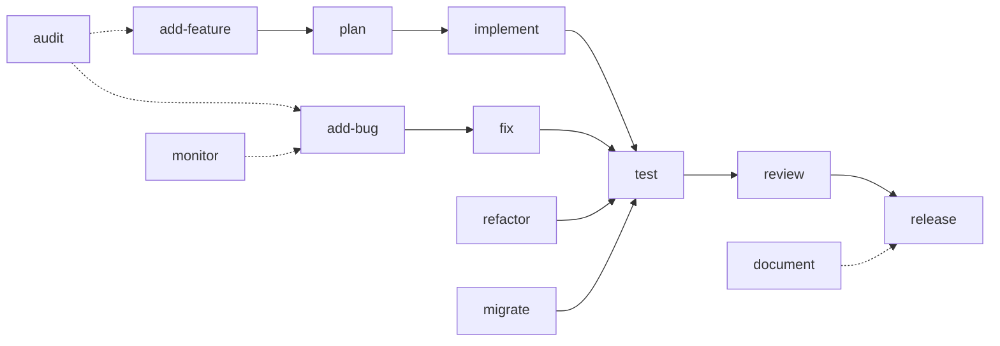

# Claude Struct Commands

This directory contains all available commands for the Claude development workflow system. Each command is designed to work seamlessly with GitHub issues and provide a complete development lifecycle.

## Command Categories

### 📋 Planning & Tracking
- [`/add-feature`](./add-feature.md) - Create and track new features
- [`/add-bug`](./add-bug.md) - Report and track bugs
- [`/plan`](./plan.md) - Create detailed specifications from features

### 🛠️ Development
- [`/implement`](./implement.md) - Generate scaffolding from issue requirements
- [`/test`](./test.md) - Validate implementation against requirements
- [`/fix`](./fix.md) - Structured bug fixing workflow
- [`/refactor`](./refactor.md) - Safe code refactoring with impact analysis

### 🚀 Deployment & Operations
- [`/release`](./release.md) - Manage releases with changelog generation
- [`/migrate`](./migrate.md) - Database migration management
- [`/monitor`](./monitor.md) - Performance monitoring and alerting

### 🔍 Quality & Documentation
- [`/audit`](./audit.md) - Comprehensive codebase analysis
- [`/review`](./review.md) - Automated PR review
- [`/document`](./document.md) - Auto-generate documentation

### 🔧 Setup & Configuration
- [`/setup`](./setup.md) - Developer environment setup

## Workflow Overview



## Quick Start

### Starting a New Feature
```bash
/add-feature "User authentication"     # Creates issue #123
/plan 123                             # Creates detailed spec
/implement 123                        # Generates code scaffolding
/test 123                            # Validates implementation
/review 456                          # Reviews PR #456
/release 2.0.0                       # Creates release
```

### Fixing a Bug
```bash
/add-bug "Login timeout issue"        # Creates issue #124
/fix 124                             # Guides through fix
/test 124                            # Validates fix
```

## GitHub Integration

All commands integrate with GitHub issues using standardized status labels:
- `Backlog` - Initial state for features
- `Ready` - Requirements defined, ready to implement
- `In progress` - Currently being worked on
- `In review` - PR created, under review
- `Done` - Completed and merged

## Command Structure

Each command follows a consistent pattern:
1. **Load Context** - Fetch issue/requirements from GitHub
2. **Process** - Perform command-specific operations
3. **Update Status** - Update GitHub issue and local tracking
4. **Generate Output** - Create files, reports, or documentation

## Configuration

Commands respect project settings in:
- `.claude/settings.local.json` - Claude permissions
- `package.json` - Project scripts and dependencies
- `.env.local` - Environment configuration
- `nodemon.json` - Development server config

## Best Practices

1. **Always Start with Issues** - Use `/add-feature` or `/add-bug` first
2. **Plan Before Implementing** - Run `/plan` to create specifications
3. **Test Everything** - Use `/test` to validate against requirements
4. **Document Changes** - `/document` keeps docs in sync
5. **Monitor Performance** - Regular `/monitor` checks prevent issues

## Advanced Usage

### Chaining Commands
Commands can be chained for efficient workflows:
```bash
/add-feature "API v2" && /plan $ISSUE_NUMBER && /implement $ISSUE_NUMBER
```

### Automation
Commands can be automated via GitHub Actions:
```yaml
on:
  issue:
    types: [labeled]

jobs:
  auto-plan:
    if: github.event.label.name == 'ready-to-plan'
    runs-on: ubuntu-latest
    steps:
      - run: claude-code plan ${{ github.event.issue.number }}
```

## Contributing

When adding new commands:
1. Follow the existing command structure
2. Integrate with GitHub issues
3. Update this README
4. Add to appropriate category
5. Include examples and options