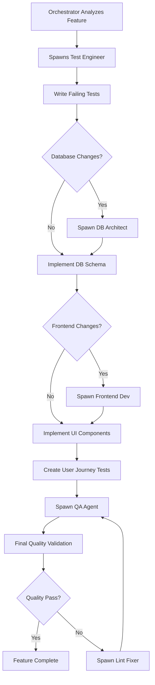

# Multi-Agent Development System

## Overview

This directory contains specialized AI agents that work together to implement complex features using Test-Driven Development (TDD) principles. Each agent has a specific role in the development workflow and operates according to strict TDD guidelines.

## 🎯 Core Philosophy

**TEST-DRIVEN DEVELOPMENT IS NON-NEGOTIABLE.** Every agent follows the RED-GREEN-REFACTOR cycle, ensuring that tests are written before any implementation code. This multi-agent system enforces proper TDD practices through specialized roles and clear workflow orchestration.

## 🤖 Agent Roles & Responsibilities

### 1. Orchestrator (`orchestrate.md`)
**Role**: Master coordinator that manages the entire multi-agent workflow
- **Responsibility**: Spawns and coordinates other agents based on feature complexity
- **TDD Enforcement**: Ensures test_engineer runs first, validates all agents follow TDD
- **When Used**: Complex features requiring multiple development areas (database, backend, frontend)
- **Key Functions**:
  - Analyzes feature requirements and determines which agents are needed
  - Enforces proper execution order (tests first, implementation second)
  - Manages inter-agent communication and status tracking
  - Generates clean commit messages without AI signatures

### 2. Test Engineer (`test_engineer.md`)
**Role**: PRIMARY agent that writes failing tests before any implementation exists
- **Responsibility**: Creates comprehensive failing tests based on acceptance criteria
- **TDD Position**: RED phase - writes failing tests that describe expected behavior
- **When Used**: FIRST in every development workflow - runs before any other implementation agent
- **Key Functions**:
  - Converts acceptance criteria into failing test cases
  - Creates test data factories using shared schemas
  - Ensures 100% behavior coverage of requirements
  - Sets up test environment and fixtures
  - **CRITICAL**: Never reads implementation code before writing tests

### 3. Database Architect (`db_architect.md`)
**Role**: Designs and implements database schemas and migrations
- **Responsibility**: Creates database structures to support test requirements
- **TDD Position**: Works with failing tests from test_engineer
- **When Used**: Features requiring new database tables, columns, or relationships
- **Key Functions**:
  - Reads test files to understand data requirements
  - Creates migration files that make database tests pass
  - Documents schema changes and business rules
  - Ensures data integrity and performance considerations

### 4. Backend Developer (`backend_dev.md`)
**Role**: Implements server-side logic, APIs, and business rules
- **Responsibility**: Creates backend code that makes failing tests pass
- **TDD Position**: GREEN phase - implements minimal code to pass tests
- **When Used**: Features requiring API endpoints, business logic, or server-side processing
- **Key Functions**:
  - Reads failing tests to understand expected API behavior
  - Implements services and controllers using functional patterns
  - Follows schema-first development with Zod validation
  - Uses options object pattern for all functions
  - **NEVER** implements features not covered by tests

### 5. Frontend Developer (`frontend_dev.md`)
**Role**: Implements user interfaces and client-side functionality
- **Responsibility**: Creates UI components that pass frontend tests
- **TDD Position**: GREEN phase - builds components to satisfy test requirements
- **When Used**: Features requiring user interface changes or new components
- **Key Functions**:
  - Reads component tests to understand expected UI behavior
  - Implements React/Vue components using functional patterns
  - Integrates with backend APIs defined by tests
  - Follows accessibility and design system guidelines
  - Uses TypeScript strict mode throughout

### 6. E2E Test Engineer (`e2e_test_engineer.md`)
**Role**: Creates end-to-end tests that validate complete user journeys
- **Responsibility**: Tests entire workflows from user perspective
- **TDD Position**: Extends RED phase with integration-level failing tests
- **When Used**: Complex features requiring full user journey validation
- **Key Functions**:
  - Creates browser-based tests using Playwright/Cypress
  - Tests complete user workflows across frontend and backend
  - Validates business processes end-to-end
  - Ensures accessibility compliance in real browser environments

### 7. QA Agent (`qa_agent.md`)
**Role**: Final quality validation and comprehensive testing
- **Responsibility**: Comprehensive quality assurance before feature completion
- **TDD Position**: Validation phase - ensures all tests pass and quality standards met
- **When Used**: Final step before feature is marked complete
- **Key Functions**:
  - Runs full test suite and validates all tests pass
  - Performs manual testing scenarios
  - Validates code quality and adherence to standards
  - Ensures documentation is complete and accurate
  - Checks for edge cases and error handling

### 8. Lint Fixer (`lint_fixer.md`)
**Role**: Automated code quality and style enforcement
- **Responsibility**: Fixes code style and quality issues while preserving functionality
- **TDD Position**: Maintenance phase - ensures code quality without breaking tests
- **When Used**: When code quality issues are detected during development
- **Key Functions**:
  - Fixes ESLint, Prettier, and TypeScript issues
  - Ensures all code follows project style guidelines
  - **NEVER** changes test behavior or implementation logic
  - Maintains functional programming patterns

## 🔄 Orchestration Workflow

### Standard Multi-Agent Flow



### Agent Communication Protocol

1. **Status Tracking**: Each agent updates shared status documents
2. **Test Handoffs**: Tests created by one agent are consumed by implementation agents
3. **Schema Sharing**: Database schemas inform all other agents
4. **Error Propagation**: Failed tests or quality issues stop the workflow
5. **Clean Handoffs**: Each agent completes its phase before the next begins

## 🛡️ TDD Enforcement Mechanisms

### Built-in TDD Safeguards

1. **Execution Order**: test_engineer ALWAYS runs first
2. **Test Validation**: Implementation agents verify tests exist before proceeding
3. **No Implementation Without Tests**: Agents refuse to work without failing tests
4. **Schema-First**: All agents use shared Zod schemas for consistency
5. **Functional Patterns**: Options object pattern enforced across all agents

### Quality Gates

- **Test Engineer**: All tests must fail initially (RED phase)
- **Implementation Agents**: All tests must pass after implementation (GREEN phase)
- **QA Agent**: Full test suite must pass with 100% behavior coverage
- **Final Validation**: No agent signatures in commits, clean code standards

## 📁 File Organization

```
.claude/commands/agents/
├── README.md                 # This file
├── FILE_CREATION_POLICY.md   # File creation guidelines
├── orchestrate.md            # Master orchestrator
├── test_engineer.md          # Primary test writer
├── backend_dev.md            # Server-side implementation
├── frontend_dev.md           # Client-side implementation
├── db_architect.md           # Database design
├── e2e_test_engineer.md      # End-to-end testing
├── qa_agent.md               # Quality assurance
└── lint_fixer.md             # Code quality fixing
```

## 🚀 Usage Examples

### Simple Feature (Backend Only)
```bash
/orchestrate "Add user profile endpoint"
# Spawns: test_engineer → backend_dev → qa_agent
```

### Complex Feature (Full Stack)
```bash
/orchestrate "Implement user dashboard with analytics"
# Spawns: test_engineer → db_architect → backend_dev → frontend_dev → e2e_test_engineer → qa_agent
```

### Database-Heavy Feature
```bash
/orchestrate "Add multi-tenant data isolation"
# Spawns: test_engineer → db_architect → backend_dev → qa_agent
```

## 🔧 Configuration & Customization

### Agent Selection Logic
The orchestrator automatically determines which agents to spawn based on:
- **Feature complexity**: Simple vs. complex implementations
- **Scope analysis**: Database, backend, frontend requirements
- **Testing needs**: Unit, integration, and E2E test requirements
- **Quality requirements**: Code quality and documentation needs

### Customization Options
- **Agent order**: Modify orchestrator to change execution sequence
- **Quality gates**: Adjust QA requirements for different project types
- **Test requirements**: Customize test coverage and quality standards
- **Framework support**: Add new agents for different tech stacks

## 📊 Monitoring & Metrics

### Agent Performance Tracking
- Test coverage achieved by test_engineer
- Implementation success rate by development agents
- Quality issues caught by qa_agent
- Time to complete multi-agent workflows

### Quality Metrics
- TDD compliance rate across all agents
- Test-first violations (should be zero)
- Code quality improvements by lint_fixer
- Feature completion success rate

## 🤝 Best Practices

### For Users
1. **Start with clear requirements**: Well-defined acceptance criteria improve agent performance
2. **Trust the process**: Let agents complete their phases before manual intervention
3. **Review agent outputs**: Each agent produces documentation of its work
4. **Use orchestrator for complex features**: Don't try to manage agents manually

### For Agent Development
1. **Maintain TDD focus**: Every agent must enforce test-first development
2. **Clear responsibilities**: Each agent should have a single, well-defined purpose
3. **Schema consistency**: All agents must use shared schemas and patterns
4. **Error handling**: Agents should fail fast when TDD principles are violated

## 🔍 Troubleshooting

### Common Issues

**Agent refuses to run**: Check that test_engineer has run first and created failing tests

**Tests not found**: Verify test files are in correct location and follow naming conventions

**Schema conflicts**: Ensure all agents are using shared schemas from the same location

**Quality failures**: Review QA agent output for specific quality issues

**Orchestration errors**: Check agent status files for workflow coordination issues

### Debug Mode
Add `--debug` flag to orchestrator for detailed agent communication logs and step-by-step workflow tracking.

---

This multi-agent system represents a significant advancement in AI-assisted development, enforcing proper software engineering practices while maintaining the flexibility to handle complex, real-world development scenarios.