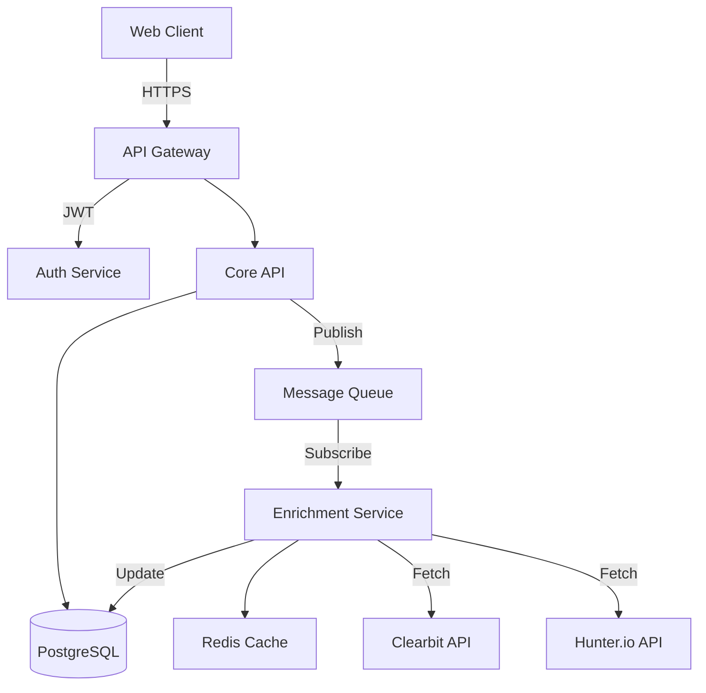

# Document Command

## Usage
`/document {component} [--format {format}] [--update]`

## Description
Automated documentation generation that keeps technical docs, API references, and architecture diagrams in sync with code.

## Documentation Types

### Components
- `api` - REST API documentation
- `database` - Schema and ER diagrams  
- `architecture` - System design docs
- `components` - UI component library
- `features` - Feature documentation
- `setup` - Installation guides

## Process Flow

1. **Code Analysis**
   - Parse source files
   - Extract comments and types
   - Analyze relationships
   - Identify patterns

2. **Documentation Generation**
   - Generate markdown files
   - Create API specs (OpenAPI)
   - Build ER diagrams
   - Generate examples

3. **Validation**
   - Check for missing docs
   - Verify examples work
   - Validate links
   - Ensure completeness

4. **Integration**
   - Update README files
   - Sync with wiki
   - Generate static site
   - Update issue docs

## Example Outputs

### API Documentation
```
/document api
```

Generated: `docs/api/README.md`
```markdown
# API Documentation

## Overview
RESTful API for contact management with enrichment capabilities.

Base URL: `https://api.example.com/v1`
Authentication: Bearer token

## Endpoints

### Contacts

#### List Contacts
```http
GET /api/contacts
```

Query Parameters:
- `page` (integer): Page number (default: 1)
- `limit` (integer): Items per page (default: 50, max: 100)
- `search` (string): Search term
- `sort` (string): Sort field (name, created_at, updated_at)
- `order` (string): Sort order (asc, desc)

Response:
```json
{
  "data": [
    {
      "id": "uuid",
      "name": "John Doe",
      "email": "john@example.com",
      "enrichment_status": "enriched",
      "created_at": "2024-01-15T10:30:00Z"
    }
  ],
  "meta": {
    "page": 1,
    "limit": 50,
    "total": 1234
  }
}
```

#### Create Contact
```http
POST /api/contacts
```

Request Body:
```json
{
  "name": "Jane Smith",
  "email": "jane@example.com",
  "company": "Acme Corp",
  "auto_enrich": true
}
```

Response: `201 Created`
```json
{
  "id": "uuid",
  "name": "Jane Smith",
  "email": "jane@example.com",
  "enrichment_status": "pending"
}
```

### Enrichment

#### Enrich Contact
```http
POST /api/contacts/{id}/enrich
```

Response: `202 Accepted`
```json
{
  "job_id": "uuid",
  "status": "queued",
  "estimated_completion": "2024-01-15T10:31:00Z"
}
```

## Error Responses

### 400 Bad Request
```json
{
  "error": "validation_error",
  "message": "Invalid request data",
  "details": {
    "email": ["Invalid email format"]
  }
}
```

### 429 Rate Limited
```json
{
  "error": "rate_limit_exceeded",
  "message": "Too many requests",
  "retry_after": 60
}
```

## Rate Limits
- Standard: 1000 requests/hour
- Enrichment: 100 requests/hour

## Webhooks
Configure webhooks to receive real-time updates:

```json
POST /api/webhooks
{
  "url": "https://your-app.com/webhook",
  "events": ["contact.enriched", "contact.updated"]
}
```
```

### Database Documentation
```
/document database
```

Generated: `docs/database/schema.md` and ERD diagram
```markdown
# Database Schema

## Overview
PostgreSQL database with 15 tables supporting contact management and enrichment.

## Entity Relationship Diagram


## Tables

### contacts
Stores core contact information.

| Column | Type | Constraints | Description |
|--------|------|-------------|-------------|
| id | UUID | PRIMARY KEY | Unique identifier |
| name | VARCHAR(255) | NOT NULL | Contact full name |
| email | VARCHAR(255) | UNIQUE, NOT NULL | Email address |
| company | VARCHAR(255) | | Company name |
| enrichment_status | ENUM | DEFAULT 'pending' | Status of enrichment |
| enrichment_score | DECIMAL(3,2) | | Quality score 0-1 |
| created_at | TIMESTAMP | NOT NULL | Creation time |
| updated_at | TIMESTAMP | NOT NULL | Last update time |

Indexes:
- `idx_contacts_email` (email)
- `idx_contacts_enrichment_status` (enrichment_status)
- `idx_contacts_created_at` (created_at DESC)

### contact_enrichment
Stores enrichment data from various sources.

| Column | Type | Constraints | Description |
|--------|------|-------------|-------------|
| id | UUID | PRIMARY KEY | Unique identifier |
| contact_id | UUID | FOREIGN KEY | Reference to contacts |
| source | VARCHAR(50) | NOT NULL | Data source name |
| data | JSONB | NOT NULL | Enrichment data |
| confidence_score | DECIMAL(3,2) | | Confidence 0-1 |
| fetched_at | TIMESTAMP | NOT NULL | When data was fetched |

Foreign Keys:
- `contact_id` → `contacts.id` (CASCADE DELETE)

## Migrations
See `/migrations` directory for version history.

## Query Examples

### Find stale enrichments
```sql
SELECT c.id, c.email, ce.fetched_at
FROM contacts c
JOIN contact_enrichment ce ON c.id = ce.contact_id
WHERE ce.fetched_at < NOW() - INTERVAL '90 days'
  AND c.enrichment_status = 'enriched';
```
```

### Architecture Documentation
```
/document architecture
```

Generated: `docs/architecture/README.md` with diagrams
```markdown
# System Architecture

## Overview
Microservices architecture with event-driven enrichment pipeline.

## Architecture Diagram


## Services

### API Gateway
- **Technology**: Node.js + Express
- **Responsibilities**: 
  - Request routing
  - Authentication
  - Rate limiting
  - Request validation

### Core API
- **Technology**: Node.js + TypeScript
- **Responsibilities**:
  - Business logic
  - Data persistence
  - Event publishing

### Enrichment Service
- **Technology**: Node.js + Bull Queue
- **Responsibilities**:
  - External API integration
  - Data aggregation
  - Quality scoring
  - Caching

## Data Flow

### Contact Creation with Enrichment
1. Client sends POST /api/contacts
2. API Gateway validates request
3. Core API creates contact record
4. Core API publishes "contact.created" event
5. Enrichment Service receives event
6. Enrichment fetches data from external APIs
7. Enrichment updates contact with data
8. Client receives webhook notification

## Scaling Strategy
- Horizontal scaling for API services
- Queue workers scale based on backlog
- Read replicas for database
- Redis cluster for caching
```

### Component Documentation
```
/document components
```

Generated: Storybook documentation
```typescript
// Generated: ContactCard.stories.tsx
import { ContactCard } from './ContactCard';

export default {
  title: 'Components/ContactCard',
  component: ContactCard,
  parameters: {
    docs: {
      description: {
        component: 'Displays contact information with enrichment status'
      }
    }
  }
};

export const Default = {
  args: {
    contact: {
      id: '123',
      name: 'John Doe',
      email: 'john@example.com',
      enrichmentStatus: 'pending'
    }
  }
};

export const Enriched = {
  args: {
    contact: {
      id: '123',
      name: 'John Doe', 
      email: 'john@example.com',
      enrichmentStatus: 'enriched',
      jobTitle: 'Software Engineer',
      company: 'Tech Corp'
    }
  }
};
```

### Feature Documentation
```
/document features --update
```

Updates: `docs/features/README.md`
```markdown
# Feature Documentation

## Contact Enrichment

### Overview
Automatically enhance contact records with professional data from multiple sources.

### User Guide

#### Enabling Enrichment
1. Navigate to Settings → Integrations
2. Enable desired enrichment sources
3. Configure API keys
4. Set enrichment rules

#### Manual Enrichment
1. Open contact profile
2. Click "Enrich" button
3. View enrichment progress
4. Review enriched data

#### Bulk Enrichment
1. Select multiple contacts
2. Choose "Bulk Actions" → "Enrich"
3. Monitor progress in Activities
4. Export enriched data

### Configuration
```yaml
enrichment:
  auto_enrich: true
  sources:
    - clearbit
    - hunter
  retry_failed: true
  stale_after_days: 90
```

### API Usage
```bash
# Single contact
curl -X POST https://api.example.com/v1/contacts/123/enrich \
  -H "Authorization: Bearer TOKEN"

# Bulk enrichment  
curl -X POST https://api.example.com/v1/enrichment/bulk \
  -H "Authorization: Bearer TOKEN" \
  -d '{"contact_ids": ["123", "456", "789"]}'
```

### Troubleshooting

**Enrichment failing?**
- Check API key validity
- Verify rate limits
- Review error logs
- Contact support

**Data quality issues?**
- Check confidence scores
- Review source reliability
- Manual verification option
- Report inaccuracies
```

## Documentation Formats

### OpenAPI Specification
```
/document api --format openapi
```

Generates: `openapi.yml`
```yaml
openapi: 3.0.0
info:
  title: Contact Management API
  version: 1.0.0
paths:
  /contacts:
    get:
      summary: List contacts
      parameters:
        - name: page
          in: query
          schema:
            type: integer
      responses:
        '200':
          description: Success
          content:
            application/json:
              schema:
                $ref: '#/components/schemas/ContactList'
```

### Markdown with Mermaid
```
/document architecture --format markdown
```

### Postman Collection
```
/document api --format postman
```

### GraphQL Schema
```
/document api --format graphql
```

## Options
- `--format` - Output format (markdown, openapi, postman, graphql)
- `--update` - Update existing documentation
- `--include-private` - Include internal APIs
- `--examples` - Generate code examples
- `--interactive` - Preview before saving

## Integration Points
- Reads from source code and comments
- Updates GitHub wiki pages
- Generates static documentation site
- Integrates with Storybook
- Syncs with API gateway configs

## Automation

### CI/CD Integration
```yaml
# .github/workflows/docs.yml
name: Update Documentation
on:
  push:
    branches: [main]

jobs:
  document:
    runs-on: ubuntu-latest
    steps:
      - uses: actions/checkout@v3
      - name: Generate Docs
        run: |
          /document api --update
          /document database --update
          /document architecture --update
      - name: Commit Changes
        run: |
          git add docs/
          git commit -m "Update documentation [skip ci]"
          git push
```

### Pre-commit Hook
```bash
#!/bin/bash
# .git/hooks/pre-commit

# Update API docs if endpoints changed
if git diff --cached --name-only | grep -q "src/api/"; then
  /document api --update
  git add docs/api/
fi
```