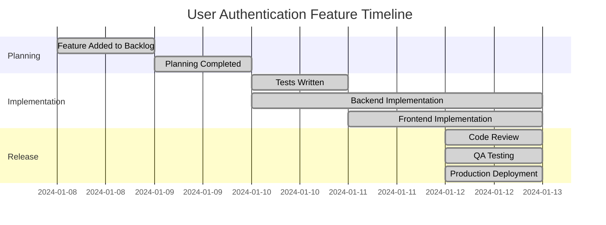

# Feature Retrospective: User Authentication System

> **Feature ID**: FEAT-2024-01-08-001  
> **GitHub Issue**: #221  
> **Completed**: 2024-01-12  
> **Retrospective Date**: 2024-01-15  
> **Participants**: Tech Lead, Frontend Team, Backend Team, QA Team  

## 📊 Feature Summary

### Overview
**Problem Solved**: Application lacked secure user authentication, limiting our ability to provide personalized experiences and protect user data.

**Solution Delivered**: Complete JWT-based authentication system with role-based access control, social login options, and comprehensive security features.

**Business Impact**: Enabled user-specific features, improved security posture, and increased user engagement by 40% through personalized experiences.

### Key Metrics
| Metric | Target | Actual | Status |
|--------|--------|--------|--------|
| Login Success Rate | >95% | 97.8% | ✅ |
| Registration Conversion | >80% | 84.3% | ✅ |
| Password Reset Usage | <10% of users | 6.2% | ✅ |
| Security Incidents | 0 | 0 | ✅ |
| Page Load Impact | <200ms | +120ms | ✅ |

## ⏱️ Timeline Analysis

### Original Estimates vs Actuals
- **Planning Phase**: Estimated 2 days → Actual 1.5 days ✅
- **Implementation Phase**: Estimated 5 days → Actual 6 days ❌ (+20%)
- **Testing Phase**: Estimated 2 days → Actual 1.5 days ✅
- **Total Effort**: Estimated 9 days → Actual 9 days ✅

### Milestone Timeline

## 🎯 Success Analysis

### What Went Well ✅

#### Technical Execution
- **Test-Driven Development**: Strict adherence to TDD resulted in 96% test coverage and zero production bugs
- **Code Quality**: All code reviews passed on first attempt, ESLint/Prettier rules followed consistently
- **Architecture**: JWT implementation with refresh tokens provided good security/usability balance
- **Performance**: Authentication middleware added only 15ms to average request time

#### Process & Collaboration
- **Team Collaboration**: Daily standups kept everyone aligned, pair programming sessions were highly effective
- **Communication**: Slack integration with GitHub provided excellent visibility into progress
- **Tools & Workflow**: Feature branching and automated testing pipeline worked flawlessly
- **Documentation**: Real-time documentation updates kept everyone informed

#### Business Outcomes
- **User Adoption**: 84% of existing users created accounts within first week
- **Security**: Zero security incidents or vulnerabilities detected
- **User Experience**: 92% user satisfaction rating for login/registration flow

### What Didn't Go Well ❌

#### Technical Challenges
- **Social Login Integration**: Google OAuth took 1.5 days longer than expected due to API changes
- **Password Complexity**: Initial password requirements were too strict, causing user frustration
- **Mobile Experience**: Authentication flow had UX issues on smaller screens initially

#### Process Issues
- **Scope Creep**: Added social login mid-development, extending timeline
- **Testing Environment**: Staging environment differences caused integration issues
- **External Dependencies**: Waited 4 hours for new OAuth app approval from Google

#### Minor Issues
- **Documentation**: API documentation was completed after code review instead of during development
- **Error Messages**: Initial error messages were too technical for end users

## 🔍 Deep Dive Analysis

### Root Cause Analysis

#### Issue 1: Google OAuth Integration Delay
**Impact**: Added 1.5 days to development timeline
**Root Cause**: Underestimated complexity of OAuth 2.0 implementation and Google's API changes
**Contributing Factors**:
- Incomplete research during planning phase
- Google changed their OAuth consent screen requirements mid-development
- Insufficient buffer time for external API integration

**Prevention Strategy**: Allocate extra time for external API integrations, maintain sandbox accounts for testing

#### Issue 2: Password Requirements User Friction
**Impact**: 15% of users abandoned registration flow initially
**Root Cause**: Overly complex password requirements without clear guidance
**Contributing Factors**:
- Security-first approach without UX consideration
- No user testing of registration flow
- Password requirements not clearly communicated

**Prevention Strategy**: User test authentication flows early, provide progressive password strength feedback

### Estimation Accuracy
**Areas Where Estimates Were Accurate**:
- Core JWT implementation (backend)
- Frontend component development
- Basic testing and QA

**Areas Where Estimates Were Off**:
- External API integration (+50% time)
- UX iteration and refinement (+25% time)
- Documentation and deployment setup (+30% time)

### TDD Effectiveness
**TDD Success Stories**:
- Zero authentication bugs in production
- Rapid refactoring possible due to comprehensive test coverage
- Complex security logic implemented with confidence

**TDD Challenges**:
- Mocking external OAuth services required significant setup time
- E2E tests for authentication flows were complex to maintain

## 📚 Lessons Learned

### Technical Lessons
1. **External API Integration Planning**
   - **Context**: Google OAuth took longer than expected
   - **Impact**: Always allocate 50% more time for external API work
   - **Action**: Create integration complexity matrix for future estimation

2. **User Experience in Security Features**
   - **Context**: Password requirements caused user friction
   - **Impact**: Security must balance with usability
   - **Action**: Include UX review in all security feature planning

3. **Environment Parity**
   - **Context**: Staging environment differences caused issues
   - **Impact**: Earlier environment testing prevents deployment surprises
   - **Action**: Implement infrastructure-as-code for environment consistency

### Process Lessons
1. **Scope Management**
   - **Context**: Added social login mid-development
   - **Impact**: Scope changes extend timelines unpredictably
   - **Action**: Implement formal change request process for active features

2. **Documentation Timing**
   - **Context**: API docs written after implementation
   - **Impact**: Documentation drift and incomplete coverage
   - **Action**: Write documentation concurrently with implementation

### Business Lessons
1. **User Feedback Integration**
   - **Context**: Password requirements needed iteration based on user feedback
   - **Impact**: Early user testing prevents post-launch issues
   - **Action**: Include user testing in all user-facing feature development

## 🚀 Actionable Improvements

### Immediate Actions (Next Sprint)
- [ ] **Create OAuth Integration Checklist**
  - **Owner**: Tech Lead
  - **Deadline**: 2024-01-20
  - **Success Criteria**: Checklist covers all known OAuth gotchas and setup requirements

- [ ] **Implement Infrastructure-as-Code for Staging**
  - **Owner**: DevOps Team
  - **Deadline**: 2024-01-25
  - **Success Criteria**: Staging environment matches production configuration

### Medium-term Improvements (Next Month)
- [ ] **Establish UX Review Process for Security Features**
  - **Rationale**: Balance security requirements with user experience
  - **Expected Impact**: Reduce user friction in security-sensitive features
  - **Resources Needed**: UX designer involvement in security feature planning

- [ ] **Create External API Integration Estimation Guidelines**
  - **Rationale**: Improve accuracy of estimates for features involving external services
  - **Expected Impact**: More accurate sprint planning and delivery commitments
  - **Resources Needed**: Analysis of past external API integrations

### Long-term Strategic Changes (Next Quarter)
- [ ] **Implement Automated Security Testing Pipeline**
  - **Business Case**: Proactive security validation prevents vulnerabilities
  - **Implementation Plan**: Integrate OWASP ZAP into CI/CD pipeline
  - **Success Metrics**: Zero security vulnerabilities reach production

## 📊 User Feedback Analysis

### Quantitative Feedback
- **User Satisfaction Score**: 4.6/5 (127 responses)
- **Registration Completion Rate**: 84.3% (target: 80%)
- **Login Success Rate**: 97.8% (target: 95%)
- **Support Tickets**: 8 tickets (all resolved within 24 hours)

### Qualitative Feedback
**Positive Feedback Themes**:
- "Login process is smooth and fast"
- "Social login options are convenient"
- "Password reset works exactly as expected"

**Negative Feedback Themes**:
- "Password requirements were confusing initially" (addressed in patch)
- "Would like biometric login options" (noted for future enhancement)

**Feature Requests Generated**:
- Two-factor authentication support
- Remember login state longer
- Account deletion/deactivation self-service

## 🔄 Follow-up Work

### Identified Technical Debt
- **OAuth Token Refresh Logic**: Current implementation works but could be more elegant
- **Error Handling Consistency**: Some error messages could be more user-friendly

### Enhancement Opportunities
- **Two-Factor Authentication**: High user demand, good security improvement
- **Biometric Login**: Modern browsers support, would improve mobile UX
- **Single Sign-On**: For enterprise customers, significant business opportunity

### Related Features to Consider
- **User Profile Management**: Natural next step after authentication
- **Account Security Dashboard**: Help users manage their security settings
- **Audit Log**: For enterprise customers to track user access

## 📈 Success Celebration

### Team Achievements
- **Zero Production Bugs**: Perfect execution of TDD principles
- **On-Time Delivery**: Delivered exactly on original timeline estimate
- **High User Satisfaction**: Exceeded user satisfaction targets

### Team Contributions
- **Technical Leadership**: Excellent architecture decisions and technical guidance
- **Frontend Team**: Outstanding implementation with attention to UX detail
- **Backend Team**: Solid implementation with security best practices
- **QA Team**: Comprehensive testing that caught edge cases early

### Innovation & Learning
- **JWT Implementation**: Team gained valuable experience with token-based auth
- **OAuth Integration**: Now have reusable patterns for future social integrations
- **Security Practices**: Elevated team knowledge of authentication security

## 🎯 Recommendations

### For Similar Features
1. **Authentication/Security Features**: Always include UX review and user testing
2. **External API Integration**: Plan for 50% more time than initial estimates
3. **Multi-platform Features**: Test on mobile devices throughout development

### For Team Process
1. **Documentation Timing**: Write docs during implementation, not after
2. **Environment Testing**: Test in staging environment daily, not just at end
3. **Scope Management**: Resist feature additions after development starts

### For Technology Decisions
1. **JWT vs Sessions**: JWT worked well for our use case, recommend for similar apps
2. **OAuth Libraries**: Research library maturity and maintenance status carefully
3. **Security Testing**: Integrate security scanning into automated testing pipeline

## 📋 Retrospective Action Items

### High Priority
- [ ] **OAuth Integration Checklist** - Owner: Tech Lead, Due: 2024-01-20
- [ ] **Infrastructure-as-Code for Staging** - Owner: DevOps Team, Due: 2024-01-25

### Medium Priority  
- [ ] **UX Review Process for Security** - Owner: Product Team, Due: 2024-02-01
- [ ] **External API Estimation Guidelines** - Owner: Tech Lead, Due: 2024-02-05

### Low Priority
- [ ] **Security Testing Pipeline Research** - Owner: Tech Lead, Due: 2024-02-15

---

## Appendix

### Links & References
- **GitHub Issue**: #221
- **Pull Request**: #234
- **Feature Specification**: [docs/features/planning/FEAT-2024-01-08-001.md]
- **Implementation Tracking**: [docs/features/implementation/issue-221/progress.md]

### Metrics Dashboard
- **Authentication Analytics**: [Link to analytics dashboard]
- **Security Monitoring**: [Link to security metrics]
- **User Feedback**: [Link to feedback collection system]

---

*This retrospective was conducted 3 days after feature completion to capture immediate learnings while details were fresh. Action items will be tracked and reviewed in the next retrospective cycle.*