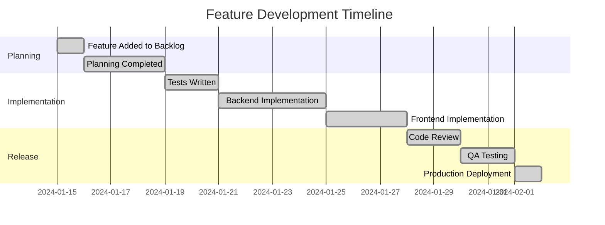

# Feature Retrospective: [Feature Title]

> **Feature ID**: FEAT-YYYY-MM-DD-XXX  
> **GitHub Issue**: #[issue-number]  
> **Completed**: YYYY-MM-DD  
> **Retrospective Date**: YYYY-MM-DD  
> **Participants**: [Team roles in retrospective]  

## 📊 Feature Summary

### Overview
**Problem Solved**: [Brief description of what problem this feature addressed]

**Solution Delivered**: [Brief description of what was actually implemented]

**Business Impact**: [Actual measured impact on business metrics]

### Key Metrics
| Metric | Target | Actual | Status |
|--------|--------|--------|--------|
| [Metric 1] | [Target value] | [Actual value] | ✅/❌/🚧 |
| [Metric 2] | [Target value] | [Actual value] | ✅/❌/🚧 |
| [Metric 3] | [Target value] | [Actual value] | ✅/❌/🚧 |

## ⏱️ Timeline Analysis

### Original Estimates vs Actuals
- **Planning Phase**: Estimated [X] days → Actual [Y] days
- **Implementation Phase**: Estimated [X] days → Actual [Y] days
- **Testing Phase**: Estimated [X] days → Actual [Y] days
- **Total Effort**: Estimated [X] days → Actual [Y] days

### Milestone Timeline

## 🎯 Success Analysis

### What Went Well ✅

#### Technical Execution
- **Test-Driven Development**: [How well TDD was followed]
- **Code Quality**: [Code quality outcomes]
- **Architecture**: [Architectural decisions that worked well]
- **Performance**: [Performance achievements]

#### Process & Collaboration
- **Team Collaboration**: [What worked well in team dynamics]
- **Communication**: [Effective communication patterns]
- **Tools & Workflow**: [Effective tools and processes]
- **Documentation**: [Documentation quality and completeness]

#### Business Outcomes
- **User Adoption**: [Positive user response]
- **Business Metrics**: [Successful business outcomes]
- **Stakeholder Satisfaction**: [Positive stakeholder feedback]

### What Didn't Go Well ❌

#### Technical Challenges
- **Technical Debt**: [Technical debt created or not addressed]
- **Performance Issues**: [Any performance problems]
- **Quality Issues**: [Bugs or quality problems post-deployment]
- **Architecture Problems**: [Architectural decisions that caused issues]

#### Process Issues
- **Planning Accuracy**: [Estimation or planning problems]
- **Communication Gaps**: [Communication breakdowns]
- **Tool Limitations**: [Tools that didn't work well]
- **Workflow Inefficiencies**: [Process bottlenecks]

#### Business/User Issues
- **User Experience**: [UX problems discovered]
- **Adoption Challenges**: [Lower than expected adoption]
- **Business Impact**: [Missed business targets]

## 🔍 Deep Dive Analysis

### Root Cause Analysis

#### Issue 1: [Description of a significant issue]
**Impact**: [How this affected the feature]
**Root Cause**: [Underlying cause of the issue]
**Contributing Factors**:
- [Factor 1]
- [Factor 2]
- [Factor 3]

**Prevention Strategy**: [How to prevent this in the future]

#### Issue 2: [Another significant issue]
**Impact**: [Effect on project]
**Root Cause**: [Why this happened]
**Contributing Factors**:
- [Factor 1]
- [Factor 2]

**Prevention Strategy**: [Future prevention approach]

### Estimation Accuracy
**Areas Where Estimates Were Accurate**:
- [What was estimated well and why]

**Areas Where Estimates Were Off**:
- [What was mis-estimated and why]
- [Learning for future estimation]

### TDD Effectiveness
**TDD Success Stories**:
- [Where TDD really helped]
- [Quality benefits observed]
- [Development speed benefits]

**TDD Challenges**:
- [Where TDD was difficult]
- [Any shortcuts taken and consequences]

## 📚 Lessons Learned

### Technical Lessons
1. **[Technical Lesson 1]**
   - **Context**: [When/where this was learned]
   - **Impact**: [How this affects future work]
   - **Action**: [What we'll do differently]

2. **[Technical Lesson 2]**
   - **Context**: [Situation that taught this lesson]
   - **Impact**: [Effect on future decisions]
   - **Action**: [Specific changes to make]

### Process Lessons
1. **[Process Lesson 1]**
   - **Context**: [What process issue was discovered]
   - **Impact**: [How this affects team efficiency]
   - **Action**: [Process improvement to implement]

2. **[Process Lesson 2]**
   - **Context**: [Process discovery]
   - **Impact**: [Effect on quality/speed]
   - **Action**: [Change to implement]

### Business Lessons
1. **[Business Lesson 1]**
   - **Context**: [Business insight gained]
   - **Impact**: [Effect on future feature decisions]
   - **Action**: [How to apply this learning]

## 🚀 Actionable Improvements

### Immediate Actions (Next Sprint)
- [ ] **[Action Item 1]**
  - **Owner**: [Team/Role responsible]
  - **Deadline**: [When this should be completed]
  - **Success Criteria**: [How we'll know it's done]

- [ ] **[Action Item 2]**
  - **Owner**: [Team/Role responsible]
  - **Deadline**: [Completion target]
  - **Success Criteria**: [Definition of done]

### Medium-term Improvements (Next Month)
- [ ] **[Improvement 1]**
  - **Rationale**: [Why this improvement is needed]
  - **Expected Impact**: [What benefit this will provide]
  - **Resources Needed**: [What's required to implement]

- [ ] **[Improvement 2]**
  - **Rationale**: [Justification for change]
  - **Expected Impact**: [Anticipated benefit]
  - **Resources Needed**: [Implementation requirements]

### Long-term Strategic Changes (Next Quarter)
- [ ] **[Strategic Change 1]**
  - **Business Case**: [Why this change is important]
  - **Implementation Plan**: [High-level approach]
  - **Success Metrics**: [How we'll measure success]

## 📊 User Feedback Analysis

### Quantitative Feedback
- **User Satisfaction Score**: [X]/5 ([Y] responses)
- **Feature Usage Rate**: [X]% of eligible users
- **Feature Retention**: [X]% users still using after 30 days
- **Support Tickets**: [X] tickets related to this feature

### Qualitative Feedback
**Positive Feedback Themes**:
- [Common positive feedback pattern]
- [Another positive theme]

**Negative Feedback Themes**:
- [Common complaint or issue]
- [Another negative pattern]

**Feature Requests Generated**:
- [Follow-up feature requested by users]
- [Enhancement suggestion from users]

## 🔄 Follow-up Work

### Identified Technical Debt
- **[Technical Debt Item 1]**: [Description and plan to address]
- **[Technical Debt Item 2]**: [Description and timeline for resolution]

### Enhancement Opportunities
- **[Enhancement 1]**: [User-requested improvement]
- **[Enhancement 2]**: [Performance or usability improvement]

### Related Features to Consider
- **[Related Feature 1]**: [How this relates to completed feature]
- **[Related Feature 2]**: [Synergy opportunity]

## 📈 Success Celebration

### Team Achievements
- **[Achievement 1]**: [What the team accomplished well]
- **[Achievement 2]**: [Another success to celebrate]
- **[Achievement 3]**: [Team growth or learning achievement]

### Team Contributions
- **[Team Area 1]**: [Specific contribution to highlight]
- **[Team Area 2]**: [Notable team achievement]
- **[Team Area 3]**: [Recognition for specific work]

### Innovation & Learning
- **New Techniques Used**: [Any new approaches tried]
- **Skills Developed**: [Team capabilities that were enhanced]
- **Knowledge Gained**: [Domain or technical knowledge acquired]

## 🎯 Recommendations

### For Similar Features
1. **[Recommendation 1]**: [Specific advice for similar work]
2. **[Recommendation 2]**: [Process or technical recommendation]
3. **[Recommendation 3]**: [Planning or execution advice]

### For Team Process
1. **[Process Recommendation 1]**: [Team workflow improvement]
2. **[Process Recommendation 2]**: [Communication or collaboration improvement]

### For Technology Decisions
1. **[Tech Recommendation 1]**: [Technology choice guidance]
2. **[Tech Recommendation 2]**: [Architecture or design guidance]

## 📋 Retrospective Action Items

### High Priority
- [ ] **[Action 1]** - Owner: [Team/Role], Due: [Date]
- [ ] **[Action 2]** - Owner: [Team/Role], Due: [Date]

### Medium Priority  
- [ ] **[Action 3]** - Owner: [Team/Role], Due: [Date]
- [ ] **[Action 4]** - Owner: [Team/Role], Due: [Date]

### Low Priority
- [ ] **[Action 5]** - Owner: [Team/Role], Due: [Date]

---

## Appendix

### Links & References
- **GitHub Issue**: #[issue-number]
- **Pull Request**: #[pr-number]
- **Feature Specification**: [Link to spec doc]
- **Implementation Tracking**: [Link to implementation doc]
- **User Research**: [Link to any user research conducted]

### Metrics Dashboard
- **Feature Analytics**: [Link to analytics dashboard]
- **Performance Monitoring**: [Link to performance metrics]
- **Error Tracking**: [Link to error monitoring]

---

*This retrospective follows our continuous improvement process. All action items will be tracked and reviewed in the next retrospective cycle.*